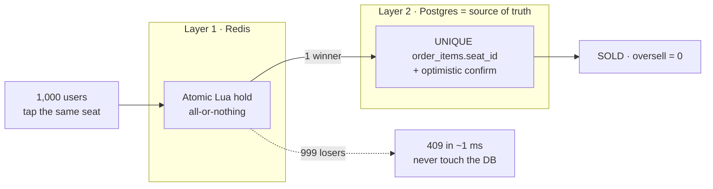

# 🎟️ Flash-Sale Ticket Booking

A reserved-seating ticket-booking system built around one hard guarantee:
**oversell = 0** — even when thousands of users slam the *same seat* in the same
instant. Correctness holds even if Redis dies.

[](https://github.com/Nakarate/ticket-booking/actions/workflows/ci.yml)
[](LICENSE)


> **The one number that matters:** in a load test where **1,000 users race for a
> single seat**, exactly **1** booking succeeds and **999** get a clean `409` in
> ~1 ms — proven down to the database (`max seats per order_item = 1`).

<!-- Screenshots: drop images in docs/media/ and uncomment.


-->

---

## Quickstart

```bash
docker compose up --build
```

- Web (seat map): http://localhost:3000
- API health: http://localhost:8080/readyz
- Postgres auto-seeds a 200-seat demo event, a 3-show production, and a 1M-row
  event for the index benchmark.

Full reset (drops the volume): `docker compose down -v && docker compose up --build`

Admin dashboard: log in as `admin@demo.local` / `admin-demo-123456`.

---

## The interesting part: a two-layer oversell guard

A booking must pass **both** layers. Either one alone prevents oversell — the
second exists so the system stays correct even if Redis fails.



1. **Redis atomic hold** — a Lua script holds *all N* requested seats or *none*
   (single-threaded, so it's atomic). It absorbs the thundering herd: the winner
   proceeds, everyone else sheds at Redis in ~1 ms without ever reaching the
   booking transaction.
2. **Postgres is the truth** — `UNIQUE INDEX order_items(seat_id)` is the final
   guard: one seat belongs to exactly one live order, enforced by the DB
   regardless of what Redis did. Payment then does an **optimistic confirm**
   (`UPDATE seats … WHERE status='AVAILABLE'`, checking the affected row count).

**If Redis is down**, the app still renders seats from the DB and booking returns
`503` — the system degrades to *"can't book"* but **never oversells**.

Other invariants: seats are locked in sorted order to avoid deadlock; every write
endpoint is idempotent (`Idempotency-Key`); the sale-open gate is enforced
server-side; seats are released by deleting `order_items` rows, not flipping a
status column. All are covered by Go integration tests.

---

## Proof (measured, not claimed)

| What | Result |
|---|---|
| **k6 race** — 1,000 VUs, one seat | `booking_success = 1`, `booking_conflict = 999`, oversell = 0 (verified in DB) |
| **Go race test** — `TestNoOversellUnderRace` | 200 goroutines fight one seat → exactly 1 wins |
| **Index-only scan** — partial covering index on 1M rows | seq scan ~34 ms → index-only ~1.3 ms (**~26×**; approaches 100× as the event nears sell-out) |
| **MVCC control** — 200 book+pay writes | `seats.n_dead_tup` 0 → 200 → 0 after `VACUUM`; autovacuum tuned to reclaim at 1% |

Numbers and how to reproduce: [docs/benchmark-results.md](docs/benchmark-results.md).
Honesty note: the ~1 s latency seen under 1,000 concurrent logins is **bcrypt**
(a deliberate security cost), not the booking path — see the benchmark doc.

---

## Security

Real auth, and self-tested against attacks. See [docs/security-review.md](docs/security-review.md).

- Password + **bcrypt**; short-lived access JWT + opaque refresh token in Redis
  (rotated on refresh, revoked on logout).
- `JWT_SECRET` is **fail-closed**: boot aborts on an empty/weak secret in production.
- Defended (and tested): SQL injection, forged tokens, client-side price tampering,
  IDOR on orders, oversell, rate-limit bypass.
- Abuse controls: Redis Lua token-bucket rate limiter (per-IP, shared across
  instances) + an optional proof-of-work challenge on login/register.

---

## Stack & layout

**Next.js 14** (web) · **Go 1.22 stdlib** (api, no web framework) · **PostgreSQL 16**
· **Redis 7** · **k6** (load). Wired together by `docker-compose.yml`.

```
api/     Go — package main (file-per-concern) + internal/config
web/     Next.js App Router — app/ (orchestrator) + features/ + components/ + lib/
db/      schema + indexes + MVCC tuning (every choice commented with why) + seed
k6/      load tests (race, checkout)
docs/    architecture map, benchmarks, security review, ADR
```

👉 **[docs/architecture.md](docs/architecture.md)** is the module map — per-file
responsibilities, key symbols with line numbers, and a route→handler table.

---

## Testing

```bash
cd api && go test ./...            # Go integration tests (need Postgres + Redis; auto-skip if absent)
cd web && npm run test:e2e         # Playwright E2E against the running stack
```

CI runs both on every push.

---

## Try it yourself

```bash
# 1,000 users race for one seat  →  success=1, conflict=999
docker run --rm -e API=http://host.docker.internal:8080 -v "$PWD/k6":/k6 grafana/k6 run /k6/race.js

# Graceful degradation — kill Redis: booking 503s, the page still renders, no oversell
docker compose stop redis && docker compose start redis

# Rate limiting — first ~5 registers 201, the rest 429
AUTH_RATE_RPS=1 AUTH_RATE_BURST=5 docker compose up -d api
```

More walkthroughs (EXPLAIN ANALYZE, MVCC/VACUUM) in [docs/benchmark-results.md](docs/benchmark-results.md).

---

## Production roadmap (deliberately out of scope here)

This is a focused demo of the concurrency/correctness core. A production build
would add: a real payment gateway with reconciliation, a waiting room for fairer
queueing under extreme load, e-ticketing + check-in, a transactional outbox, read
replicas, refunds, and PDPA/GDPR data controls. The
[ADR](docs/adr/0001-build-vs-buy-auth-and-abuse-controls.md) records the
build-vs-buy reasoning (e.g. Auth0/Cloudflare in production vs. in-house here).

## License

MIT — see [LICENSE](LICENSE).
